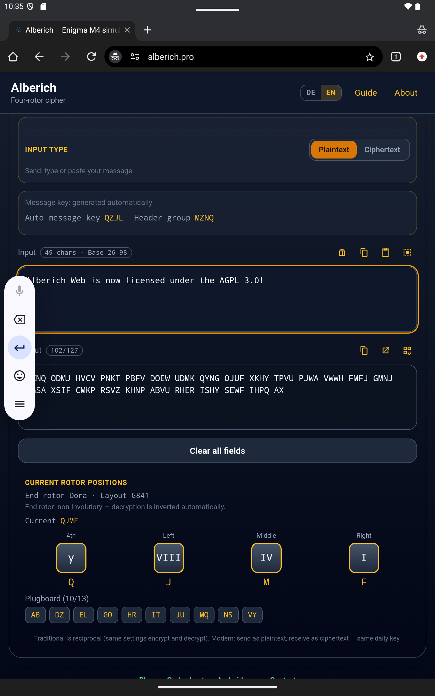
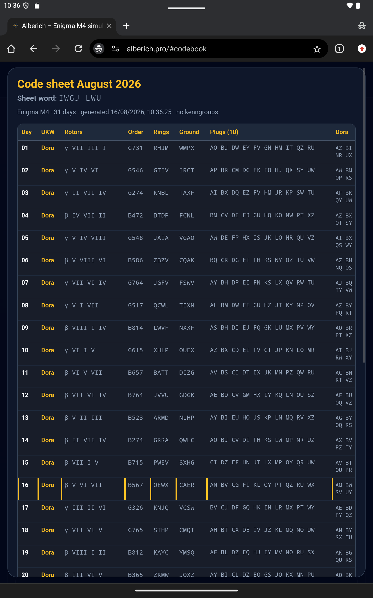

# Alberich

Enigma-M4 machine in the browser: **Traditional** (historical, involutory) and
**Modern** (experimental rotor protocol). Daily keys, networks, month
sheets, courier QR.

- Live instance: [https://alberich.pro/](https://alberich.pro/)
- Versions: see [VERSIONS](VERSIONS) — the same numbers as the live apps:
  web `1.0 (Revision 50)`, browser `1.0.24`, Thunderbird `1.0.14`,
  Android `1.0 (Revision 29)` / code 29. Not a separate GitHub count.
- Platforms here: static **web** app, **browser companion** (Chrome / Edge /
  Firefox), and **Thunderbird** MailExtension
- Not in this tree: Android sources, store listings

SPDX-License-Identifier: `AGPL-3.0-only`

<p align="center">
  
  
</p>

## Features

- Traditional M4 simulator
- Modern: visible rotors, rings, plugs, notches, and end-rotor wiring;
  ALBV telegram; 4-letter message key; A–Z groups; check group (HMAC-SHA-256);
  8-letter message id
- Month sheets, networks, sheet word (Tafelwort)
- Courier: letters and QR only on the online device
- German and English UI, no account, no build step
- The cryptographic workspace performs no analytics or telemetry.
  No tracking. No external analytics scripts.

## Requirements

- A current browser to run `web/`
- Node.js **18+** to run `bash scripts/test.sh` (CI matrix: 18, 20, 22)
- Python 3 only for the independent reference in `reference/`

There is no `.env` and no npm install. The few `package.json` files are ESM
markers for Node 18 (`"type": "module"`), not a dependency tree.

## Installation / development

```bash
cd web
./start.sh
```

http://localhost:8765

### Browser companion

The Git source tree keeps a shared `extensions/browser/shared/` folder.
Chrome and Edge **symlink** to it. A GitHub ZIP of the repository is **not**
a loadable extension on Windows — those symlinks do not survive a download.

**Developers with a git clone**

Source of truth is `extensions/browser/shared/`. After panel edits run
`extensions/browser/sync-from-chrome.sh`.

**Local testing (any OS)**

```bash
bash scripts/package-extensions.sh
```

Then load unpacked from:

```text
dist/extensions/chrome/
dist/extensions/edge/
dist/extensions/firefox/
```

Those folders contain real files, not symlinks.

**Normal users**

Use the GitHub Release ZIP, for example:

```text
alberich-chrome-VERSION.zip
alberich-edge-VERSION.zip
alberich-firefox-VERSION.zip
```

Thunderbird: developers load temporarily from
`extensions/thunderbird/manifest.json`. Users take the Thunderbird file
from the same GitHub Release.

```bash
bash scripts/test.sh
bash scripts/test-research.sh
bash scripts/test-repository.sh
bash scripts/test-packaging.sh
```

## Documentation

- [Architecture](docs/architecture.md)
- [User guide](docs/user-guide/) — same Kurzanleitung as in the app
- [Screenshots](docs/screenshots/)
- Tutorials: [alberich.pro/blog](https://alberich.pro/blog/)
- [Crypto specification](docs/crypto-spec/overview.md)
- [Threat model](docs/threat-model.md)
- [Changelog](CHANGELOG.md)
- [Contributing](CONTRIBUTING.md)
- [Security](SECURITY.md)

## Security

Modern is a specified experimental rotor protocol, not a NIST algorithm.
Read [SECURITY.md](SECURITY.md) before using it for anything that matters.

Never commit a real month sheet.

- V3 demo: `examples/demo-codebook-v3.json` — sheet word `CPTZ YYH`
- Legacy two-day sample: `examples/demo-month-sheet.json` — sheet word `CXRI YQP`

## License

This project is licensed under the **GNU Affero General Public License
Version 3.0 only** (`AGPL-3.0-only`).

Alberich is licensed under AGPL-3.0-only. Derivative works (including apps)
must also be licensed under AGPL-3.0-only, and the complete corresponding
source must be made available. Commercial use is allowed if those conditions
are met.

Alberich steht unter der AGPL-3.0-only. Abgeleitete Werke (einschließlich
Apps) müssen ebenfalls unter der AGPL-3.0-only lizenziert und der
vollständige Quellcode zur Verfügung gestellt werden. Kommerzielle Nutzung
ist erlaubt, solange diese Bedingungen eingehalten werden.

See [LICENSE](LICENSE) for the full text and [COPYRIGHT](COPYRIGHT) for the
holder. Bundled libraries keep their own terms ([THIRD_PARTY.md](THIRD_PARTY.md)).
The name and gold-A mark are reserved ([docs/BRANDING.md](docs/BRANDING.md)).

The name **Alberich** and the gold-A-in-gear mark are **not** licensed under
the AGPL. Forks should pick their own name unless we agree otherwise.
